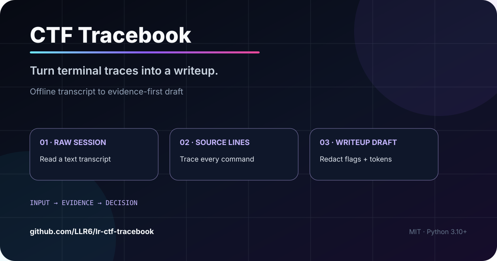
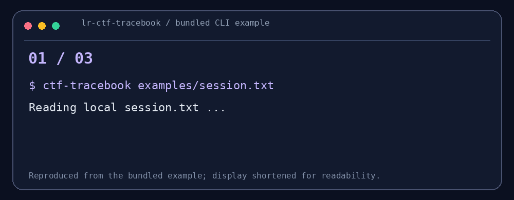

# CTF Tracebook

<p align="center"></p>
<p align="center"></p>
<p align="center"><sub>示例来自仓库自带的 session.txt；画面为便于阅读的节选。</sub></p>
<p align="center"><strong>打完一道题，让复盘从证据开始，而不是从记忆开始。</strong></p>
<p align="center">纯文本终端记录 → 带源行号的 Markdown / JSON 草稿；默认遮盖 flag 与常见口令。</p>
<p align="center"><a href="#30-秒看懂">30 秒看懂</a> · <a href="#5-分钟开始">5 分钟开始</a> · <a href="#能力与边界">能力与边界</a></p>
<p align="center">   </p>

## 30 秒看懂

你已经保存了终端记录，但命令、观察与推理散在一整段文本里。Tracebook 读取**已有记录**，提取常见 shell 提示符后的命令，保留对应输出和源文件行号，并给出待补充的推理栏位。

```text
终端文本 → 命令与观察 → 源行号 + SHA-256 → 去敏复盘草稿
```

## 30 秒试玩

```bash
python -m pip install -e .
ctf-tracebook examples/session.txt --title "一道 ELF 题的复盘" > writeup.md
```

示例草稿节选（来自 `examples/session.txt`）：

```text
源文件 L1: file challenge
观察: challenge: ELF 64-bit LSB executable

源文件 L3: checksec --file=challenge
观察: Full RELRO / Canary / NX / PIE

源文件 L5: python3 solve.py
观察: [REDACTED FLAG]
```

## 三个值得看的点

- **可回查**：每一步带源行号，原始记录的 SHA-256 写进草稿。
- **默认去敏**：遮盖 flag、常见 Token/口令和 PEM 私钥块；`--keep-flags` 需主动开启。
- **不替你编造推理**：每一步为何这样做，仍由解题者补充。

## 5 分钟开始

要求 Python 3.10+。输入是你自己复制或导出的**纯文本记录**。

```bash
git clone https://github.com/LLR6/lr-ctf-tracebook.git
cd lr-ctf-tracebook
python -m pip install -e .
ctf-tracebook examples/session.txt --title "一道 ELF 题的复盘" > writeup.md
ctf-tracebook examples/session.txt --format json
```

支持常见 `$`、`#`、`>>>` 和 PowerShell 提示符；实际提取情况请用自己的记录核对。输出是草稿，公开前请逐行检查目标地址、账号、密钥、未公开题目与授权范围。

## 能力与边界

不执行输入中的任何命令，不连接目标，不推断漏洞原理或“自动解题”。正则去敏无法覆盖所有敏感字段。仅用于有授权的比赛或训练复盘；任何错误归因和遗漏需要人工修订。

## 参与 / Help Wanted

欢迎提交**去敏**的提示符、换行命令或失败路线样例。下一步可做可编辑时间线、附件哈希与失败尝试分组。验证代码：`python -m unittest discover -s tests`。

作者：LLR6 · MIT License
